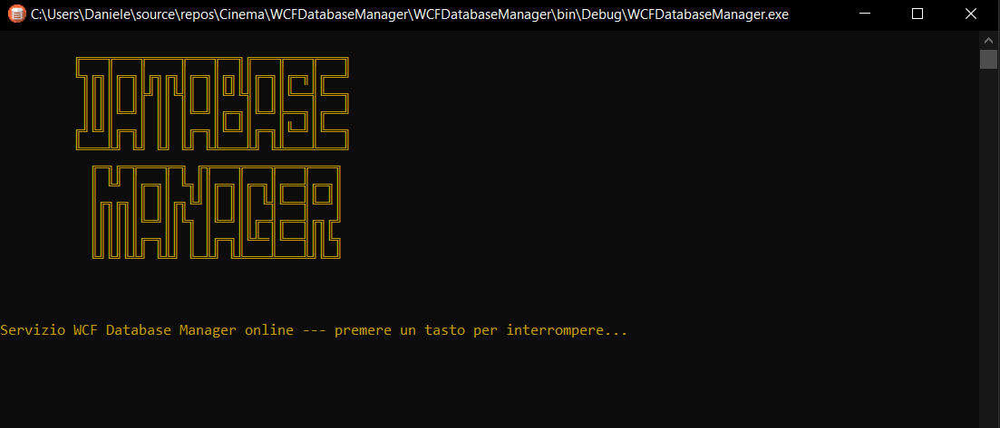
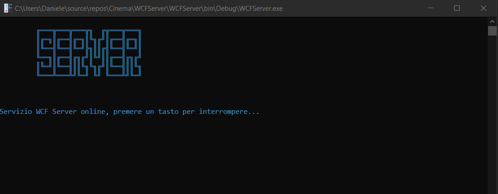
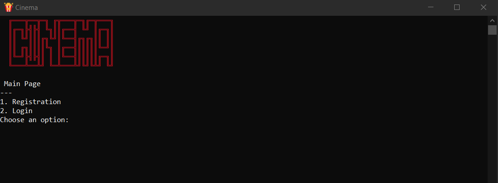
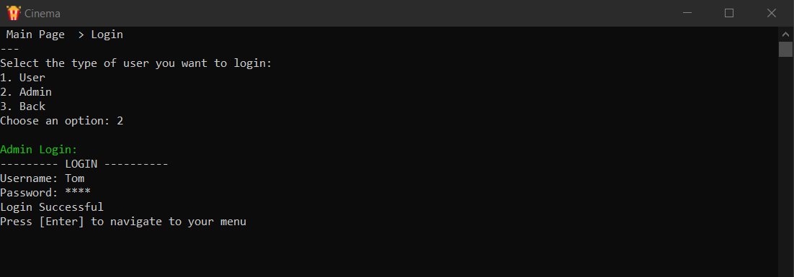
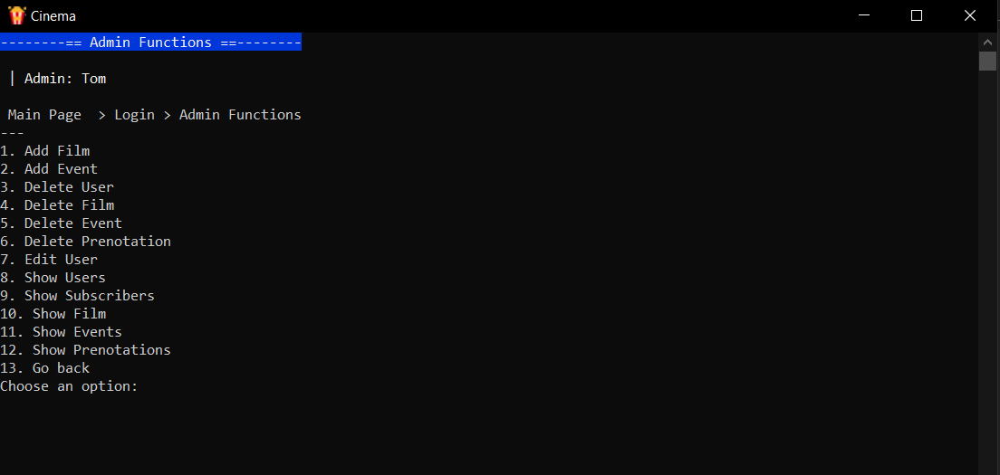
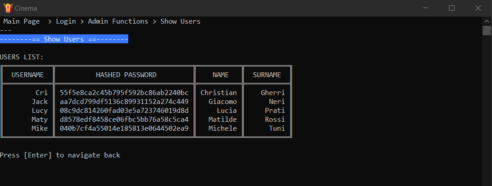
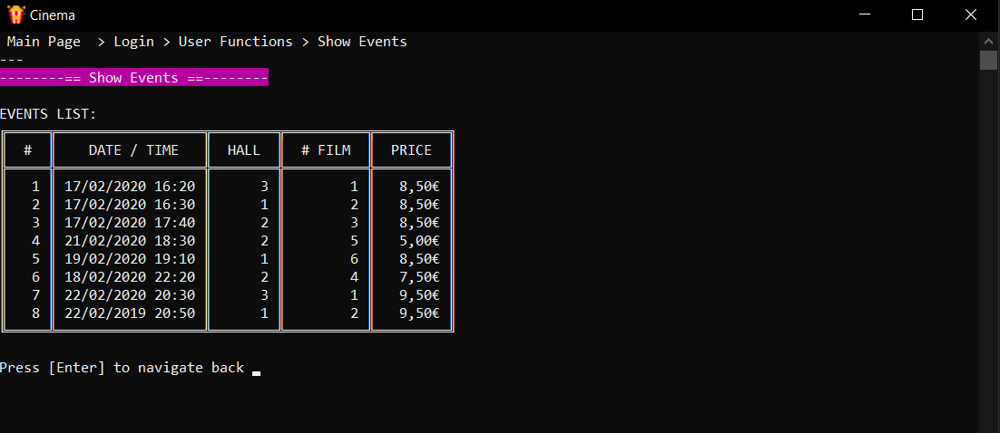
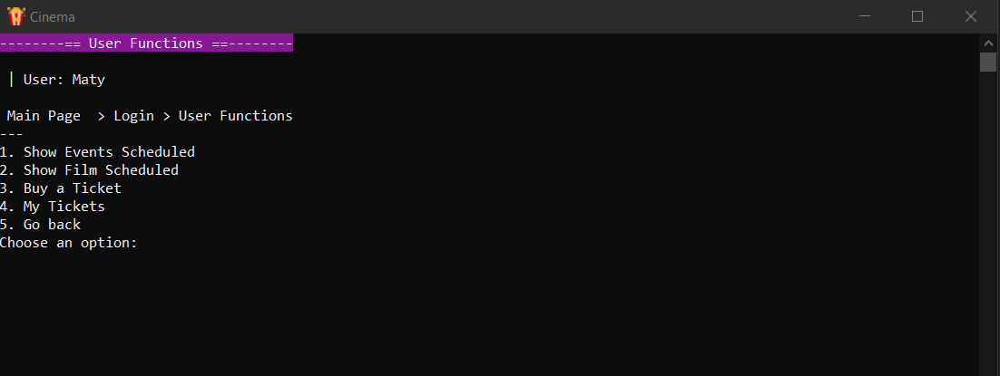
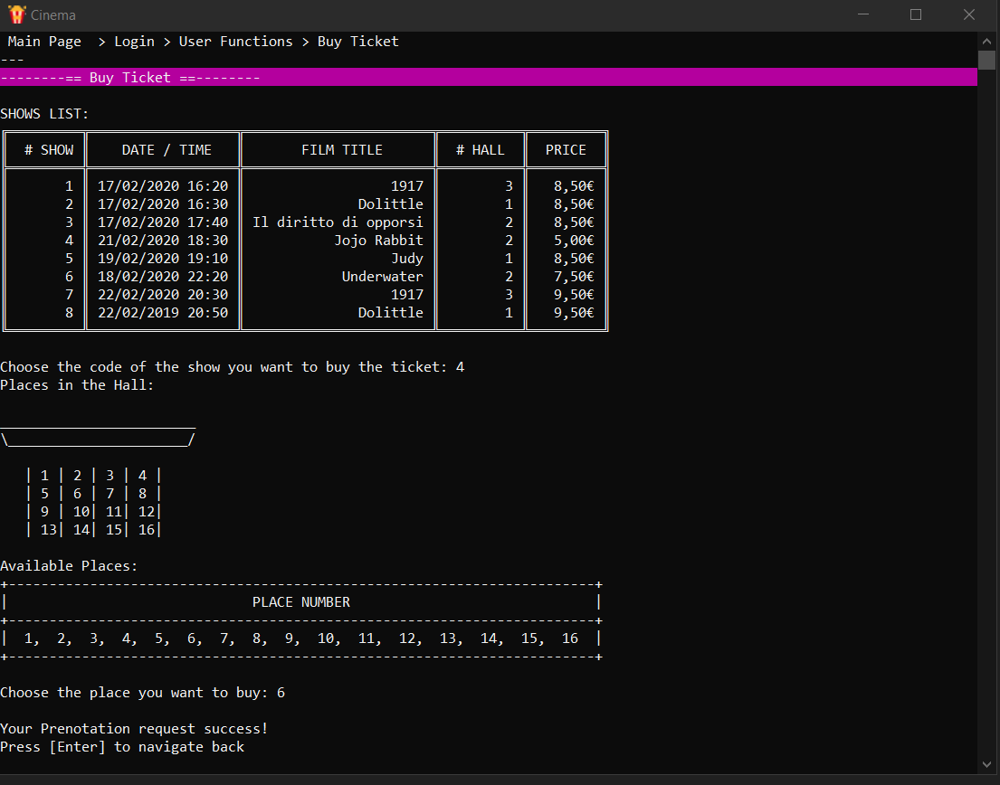
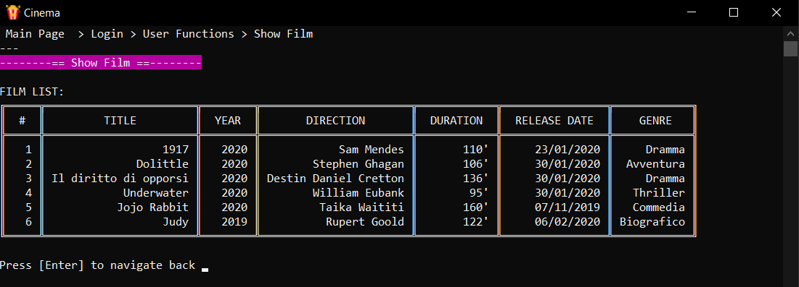

<!-- PROJECT LOGO -->
   
    

  
  <h1 align="center">Cinema</h1>
  

    C# implementation of a console software representing a Cinema with film and events.
  

  

    WCF Service for Client-Server, Server-Database connections and SQL Server Express
  

  
  <!-- TABLE OF CONTENTS -->
  ## Table of Contents
  
  - [Table of Contents](#table-of-contents)
  - [About The Project](#about-the-project)
  - [Database](#database-scheme)
  - [Getting Started](#getting-started)
    - [Libraries](#Libraries)
    - [Updates](#updates)
  - [Screenshots](#screenshots)
  - [License](#license)
  - [Contributors](#contributors)
   
   <!-- ABOUT THE PROJECT -->
   ## About The Project
   **Cinema** simulates a cinema with different Film, Hall and Show (here called Events). It's a console 
   program that uses WCF Services to book tickets of a cinema trough a series of command lines.  
   
   The system is made up of a MySQL Server Express Database to which the WCFDatabaseManager connects to, 
   which has the task to keep the personal data of the users, the administrators, the film, the events,
   informations about the hall and the informations about a user's ticket (here called Prenotation). 
   A user can register to the cinema, or buy a ticket for an event and see the list of the events and the film
   the Cinema has. An administrator can do some management operations.
   
   Every change is stored on the database.
   
   Every member has a different username, and the other tables has a integer as a primary key, to make every data unique.
   
   A new user can register to the system by giving his personal data and choosing an username which must be not 
   already taken. The system provides to forbid the assignment of a username if a person with that same username already 
   exists. In this case, it provides to notify the error to the user. Once he signs in, he buy a ticket for an event, see 
   the list of the film and the events available, and the history of his prenotations (his tickets).
   
   Administrators can register themselves by inserting a username which must not to belong to others admins and log in 
   the system. They can see the list of the members registered to the club, edit them or delete their accounts from the database.
   They can add and delete film, events, and delete the prenotations of a user. They have access at every sort of list in the
   database: events, film, prenotations and users ones.

  The system has a console GUI, that starts with the login/registration form.
    
    - You have to select if you want to sign in as a user or as administrator. Once you insert the right credentials
       the system will open your menu.
    
    - You can register yourself to the database by inserting an username, which as primary key of the table must be 
       different from anyone else. Your password will be hidden when you insert it and it will be stored hashed, 
	  once you complete the registration. From now you can login with your new credentials.
    
    - Once logged you will be redirected to your menu, where the console input of a integer number will guide you to 
	   the different operations you are allowed to perform. From this page you can also choose to logout by pressing
	  the number related to "Back" action, to come back to the login/registration form.
    
   
   <!-- DATABASE  -->
   ## Database Scheme
   
   
   <!-- GETTING STARTED -->
   ## Getting Started
   You can just clone this repository and run the "script + data.sql" in "Database/" folder to create the
   database with some data already in. Before that, remember that the program requires 2 NuGet Packets installed.
   
   ### Libraries
   The program requires two NuGet Packets to be executed.
   
   	- <a href="https://github.com/splttingatms/EasyConsole" title="EasyConsole">EasyConsole</a>
			
	- <a href="https://github.com/douglasg14b/BetterConsoleTables" title="BetterConsoleTables">BetterConsoleTables</a>

   ### Updates
   Pull this repository for updates.
   
   <!-- LICENSE -->
   ## LICENSE
   Distributed under the GPL License. See `LICENSE` for more information.
   
Icons made by <a href="https://www.flaticon.com/authors/mynamepong" title="mynamepong">mynamepong</a> from <a href="https://www.flaticon.com/" title="Flaticon">www.flaticon.com</a>

   
Icons made by <a href="https://www.flaticon.com/authors/freepik" title="Freepik">Freepik</a> from <a href="https://www.flaticon.com/" title="Flaticon">www.flaticon.com</a>

   
   <!-- LICENSE -->
   ## SCREENSHOTS
   
   
   
   
   
   
   
   
   
   
   
   <!-- CONTRIBUTORS -->
   ## CONTRIBUTORS
   [Daniele Pellegrini](https://github.com/danielepelleg) - 285240
   
   [Riccardo Fava](https://github.com/BeleRicks11) - 287516
